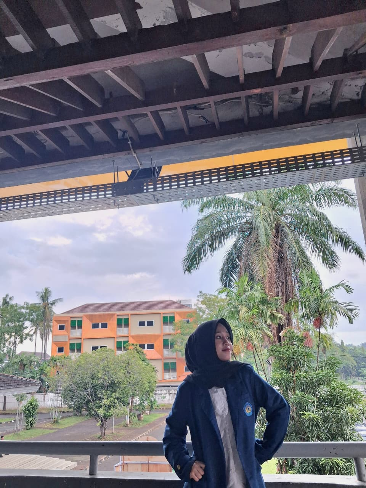

<html lang="id">
<head>
  <meta charset="UTF-8">
  <meta name="viewport" content="width=device-width, initial-scale=1.0">
  <link rel="stylesheet" href="style.css">
</head>
<body>
  

    

      <h1>Hai, Selamat Datang di ruang kecilku di dunia digital 🌸</h1>
      
Kenalan sama aku yuk ✨

      <button id="startBtn" class="btn">lets go 💕</button>
    

  

  <header>
    <nav class="navbar">
      <h1 class="logo">🌸 My Profile</h1>
      <ul class="nav-links">
        <li><a data-target="home" class="active">Home</a></li>
        <li><a data-target="about">About Me</a></li>
        <li><a data-target="portfolio">Portfolio</a></li>
      </ul>
      <button id="darkModeBtn"></button>
    </nav>
  </header>

  <main>
    <section id="home" class="active home slide">
  

    <h2>Hai, aku Dini Artika Rahmawati 💕</h2>
    

      Aku seorang mahasiswi di <b>Universitas Lampung</b> yang memiliki ketertarikan besar di dunia 
      <b>teknologi, desain, dan pengembangan web</b>. Bagiku, setiap baris kode adalah bentuk seni — 
      dan setiap desain adalah cerita yang bisa menyentuh hati ✨
    

    

      Saat ini aku sedang mendalami <b>front-end development</b> dan <b>UI/UX design</b>, 
      sambil terus belajar untuk menciptakan karya yang bukan hanya berfungsi, 
      tapi juga punya sentuhan estetika yang lembut dan bermakna 🌷
    

    

      Lewat website kecil ini, aku ingin berbagi perjalanan belajarku, 
      proyek-proyek yang aku kerjakan, serta hal-hal kecil yang menginspirasi kehidupanku 💖
    

    <button class="btn" onclick="document.querySelector('[data-target=\'portfolio\']').click()">
      Lihat Karyaku ✨
    </button>
  

  
</section>

    <section id="about" class="about slide">
      

        
        

          <h2>Tentang Aku 🌷</h2>
          
Halo! Namaku Dini Artika Rahmawati, mahasiswi <b>Pendidikan Teknologi Informasi Fakultas Keguruan & Ilmu Pendidikan</b> di Universitas Lampung.

          <ul>
            <li>🎓 <b>Pendidikan:</b> Universitas Lampung</li>
            <li>💻 <b>Minat:</b> Desain UI/UX, Pemrograman Web, Konten Kreatif</li>
            <li>⭐ <b>Keahlian:</b> HTML, CSS, JavaScript, Canva, Photoshop</li>
            <li>🎨 <b>Hobi:</b> Membaca, desain grafis, fotografi</li>
          </ul>
        

      

    </section>

    <section id="portfolio" class="slide">
      <h2>Portfolio ✨</h2>
      
Beberapa karya dan project dummy yang pernah aku buat 👇

      
      

        

          <h3>Sistem Absensi Barcode</h3>
          
Mockup aplikasi mobile untuk sistem absensi mahasiswa.

          <embed src="dokumen/Absensi_Barcode.pdf" type="application/pdf" width="100%" height="450px" />
        

        

          <h3>Website Sekolah</h3>
          
Pembuatan Website Portofolio Sekolah.

          <embed src="dokumen/Website_Sekolah.pdf" type="application/pdf" width="100%" height="450px" />
        

        

          <h3>Aplikasi Baca Cepat</h3>
          
Rancangan & Desain Aplikasi Mobile.

          <embed src="dokumen/Aplikasi_Baca Cepat.pdf" type="application/pdf" width="100%" height="450px" />
        

      

      

        <h2>Hubungi Aku 💌</h2>
        
Kamu bisa menghubungiku lewat form ini atau via media sosial 📩

        <form id="contactForm">
          <input type="text" id="name" placeholder="Nama" required>
          <input type="email" id="email" placeholder="Email" required>
          <textarea id="message" placeholder="Tulis pesanmu..." required></textarea>
          <button type="submit" class="btn">Kirim</button>
        </form>

        

  <h3>Atau hubungi aku lewat:</h3>
  

    <a href="mailto:diniartika2402@gmail.com" class="social-item" target="_blank">
      📧 diniartika2402@gmail.com
    </a>
    <a href="https://www.instagram.com/dnrtkaa/" class="social-item" target="_blank">
      📸 @dnrtkaa
    </a>
    <a href="https://diniartika2402-spec.github.io/webprofil_dini/" class="social-item" target="_blank">
      💻 GitHub Portfolio
    </a>
  

    </section>
  </main>

  <footer>
    
&copy; 2025 by Dini Artika Rahmawati

  </footer>

  
</body>
</html>
